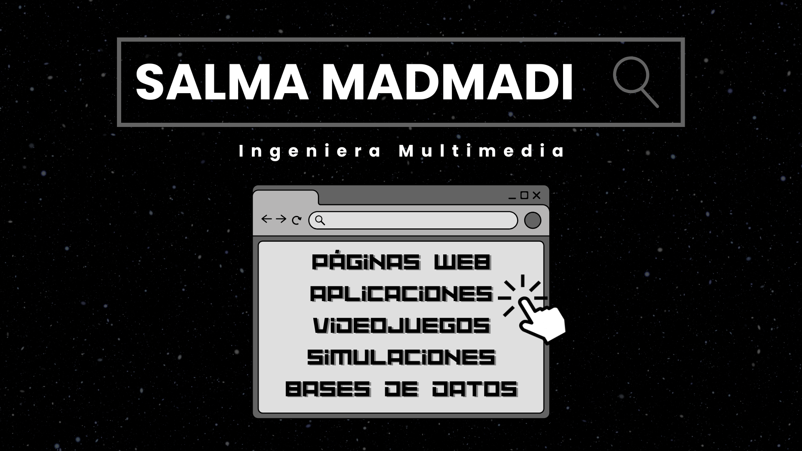
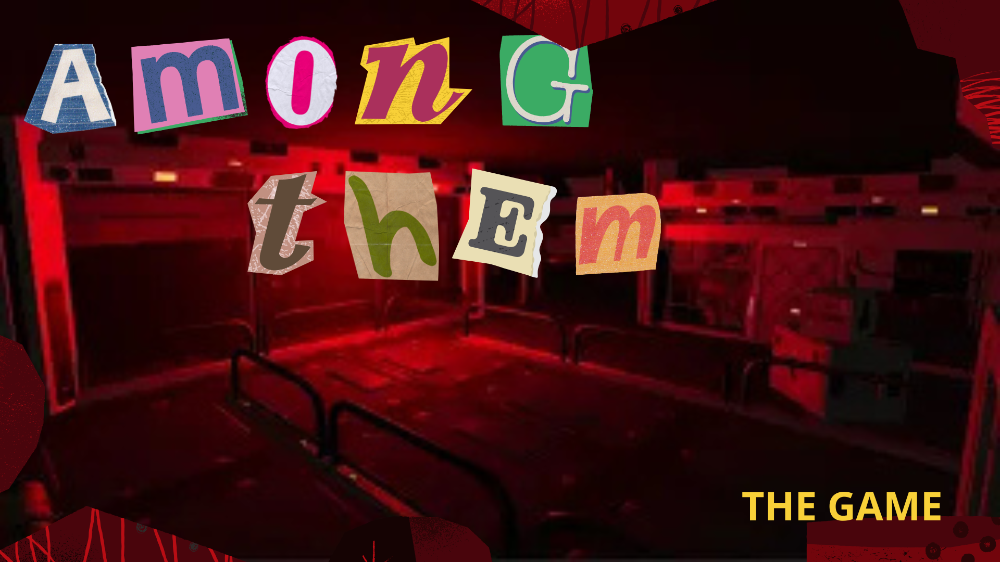
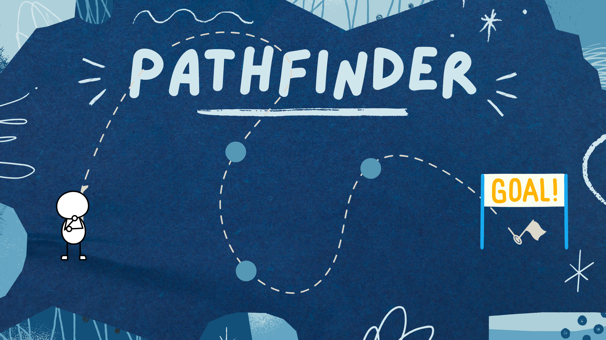
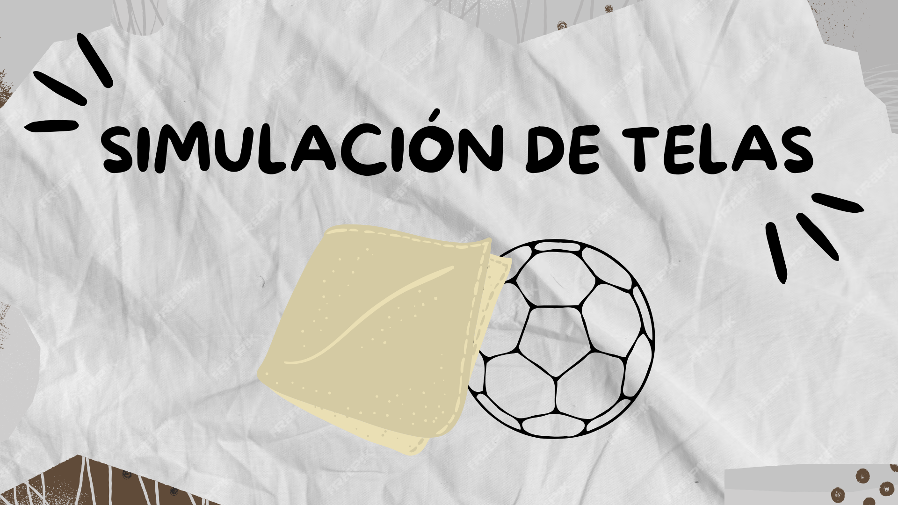
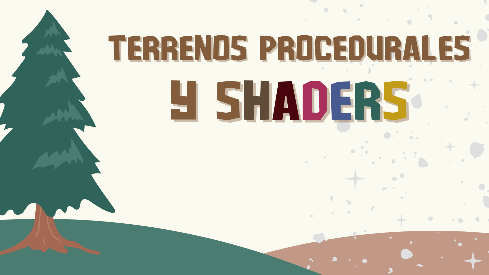
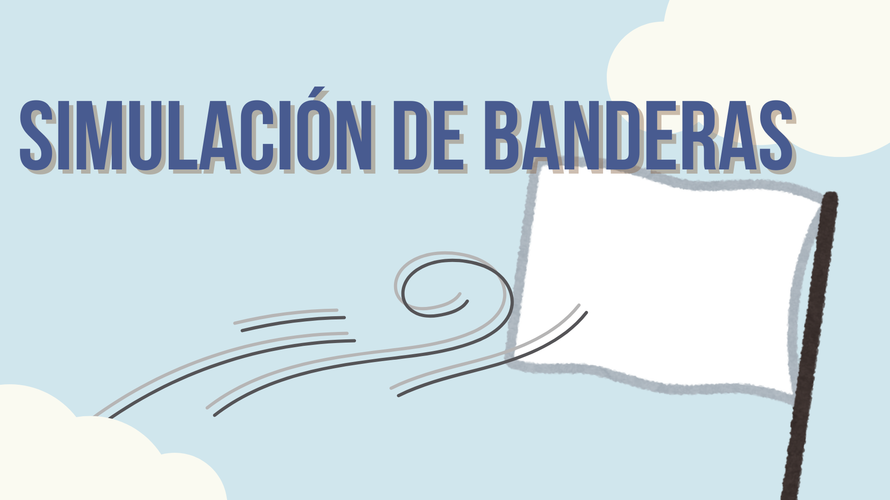

  

## 👉 Sobre mí
Soy una recién **Graduada en Ingeniería Multimedia** y este es mi perfil de GitHub! (aún está en pruebas)

## 📹 Vídeos de mi canal de [Youtube](https://www.youtube.com/channel/UCrSFdvnDI3uNhov7pKaYm4g)

### Conocimientos

  
  
  
  
  
  
  
  
  
  
  
  
  
  
  
  
  

###
